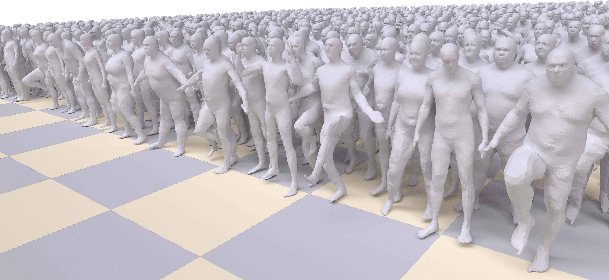

# Multi-Chart Generative Surface Modeling

<p align="center">
  
</p>

This repository contains the source code for the SIGGRAPH Asia 2018 paper: [Multi-Chart Generative Surface Modeling ](https://arxiv.org/pdf/1806.02143).

This paper introduces a 3D shape generative model based on deep neural networks. A new image-like (i.e., tensor) data representation for genus-zero 3D shapes is devised. It is based on the observation that complicated shapes can be well represented by multiple parameterizations (charts), each focusing on a different part of the shape. The new tensor data representation is used as input to Generative Adversarial Networks for the task of 3D shape generation.The effectiveness of the method is demonstrated for the task of anatomic shape generation including human body and bone (teeth) shape generation.

## Getting Started

### Setting up the environment
#### Network
The code is compatible with python 3.5 and tensorflow 1.6.

Additional packages: bunch, tqdm
```
pip install tqdm
pip install bunch
```
#### Data pre and post processes
The code is compatible with Matlab

### Downloads
Clone the repository and work from the project directory.

#### Data and pre-trained model
Download the human models data (~6.3 Gb) and a pre-trained GAN model (~2.6 Gb) on this dataset:
```
python3 download_data_and_model.py
```
The script downloads, unzips and places the files in the appropriate paths in the project directory.

## Running

### Generating Examples from Pre-trained Model
After downloading the data and the pre-trained model:
```
python3 evaluate_main.py -c=configs/config.json
```
To inspect the results, run in Matlab:
matlab/inspectGeneratedData.m

### Preparing a New Database
To create a new database follow the example in: matlab/createDataset.m
And then wrap the images to tfrecords:

```
python3 convert_to_tfrecords.py --database_signature=<database_signature>
```

### Training
To train a new model, create a config file as the template in configs/config.json
```
python3 gan_main.py -c=configs/<my_config>.json
```

## Acknowledgments
This research was supported in part by the European Research Council (ERC Consolidator Grant, ”LiftMatch” 771136), the Israel Science Foundation (Grant No. 1830/17). We would like thank the authors of  [AtlasNet](http://imagine.enpc.fr/~groueixt/atlasnet/) and of   [Deformable Shape Completion with Graph Convolutional Autoencoders](https://arxiv.org/abs/1712.00268) for sharing their results for comparison.
